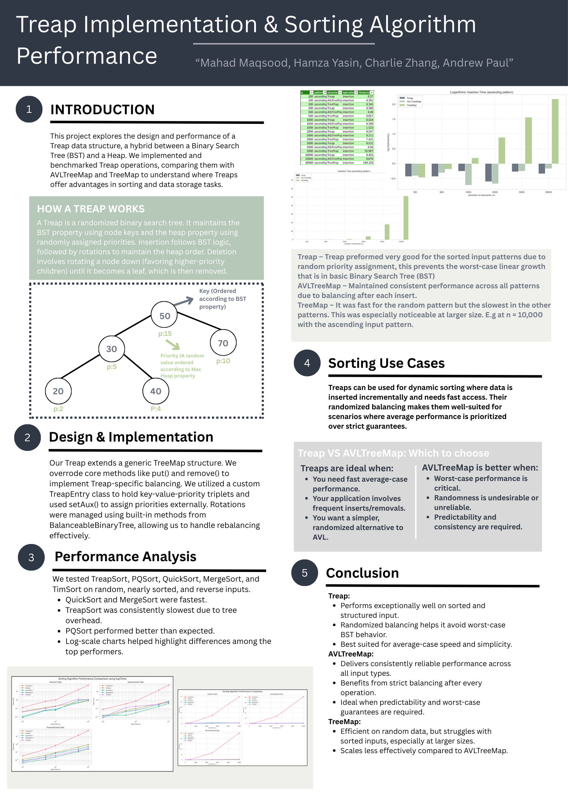

# Treap Data Structure & Sorting Algorithm Performance Analysis	

A comprehensive Java library containing core data structures implemented from scratch, including lists, stacks, queues, trees, hash tables, priority queues, and a fully-functional **Treap** with performance analysis.

This project was developed as part of my Computer Science coursework at **University College Dublin**, and showcases strong Java fundamentals, algorithmic design, data structure implementation, and benchmarking.

---

## 📌 Features

### ✔️ Lists
- Singly Linked List  
- Doubly Linked List  
- Circular Linked List  

### ✔️ Stacks & Queues
- Array-based Stack  
- LinkedList-based Stack  
- Array Queue  
- LinkedList Queue  

### ✔️ Trees
- Binary Tree  
- Binary Search Tree (BST)  
- AVL Tree  
- Red-Black Tree  
- Splay Tree  
- Treap (Randomized BST + heap property)

### ✔️ Priority Queue & Heap
- Binary Heap  
- Priority Queue implementations  

### ✔️ Hash Table & Maps
- Custom Hash Table  
- Map / Entry interfaces  
- Collision handling logic  

### ✔️ Utilities
- Timer class for benchmarking  
- Benchmark.java driver  
- Utility algorithms (e.g., Bubble Sort for simple comparisons)

---

## 🧠 Treap Implementation & Performance Analysis

This project includes a full implementation of a **Treap**, a randomized balanced binary search tree.  
We benchmarked Treap performance and compared it against:

- AVLTreeMap  
- TreeMap (Java’s built-in Red-Black Tree)

### 📊 Research Poster  

---

<p align="center">
  
</p>

This poster illustrates:
- How a Treap works (BST + heap priority)  
- Performance vs AVLTreeMap / TreeMap  
- Use-cases for randomized balancing  
- Conclusions from our performance testing  

---

## 📂 Project Structure

```
/src
  /list
  /stacksqueues
  /tree
  /priorityqueue
  /hashtable
  /interfaces
  /utils
Benchmark.java
README.md
```

Each package contains a fully-implemented data structure and, in many cases, corresponding tests or helpers.

---

## 🚀 Getting Started

Clone the repository:

git clone https://github.com/Zhang-Charlie/Treap-Data-Structure-Sorting-Algorithm-Performance-Analysis.git)

cd Java-Data-Structures-Library

Compile everything:

javac -d out $(find src -name "*.java") Benchmark.java

Run the benchmark:

java -cp out Benchmark

---

## 🎓 Educational Value

This project demonstrates:

- Understanding of low-level data structure behaviour  
- Balanced tree rotations and priority management  
- Hash table indexing and collision handling  
- Algorithmic time/space complexity  
- Clean object-oriented Java design  

It is ideal for learning, interview preparation, or contributing to open-source educational tools.
